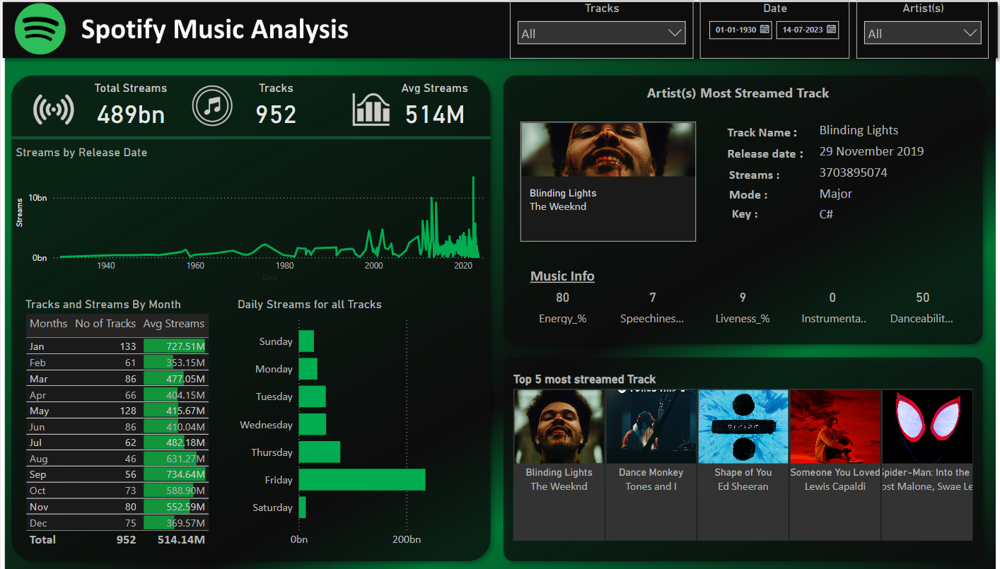
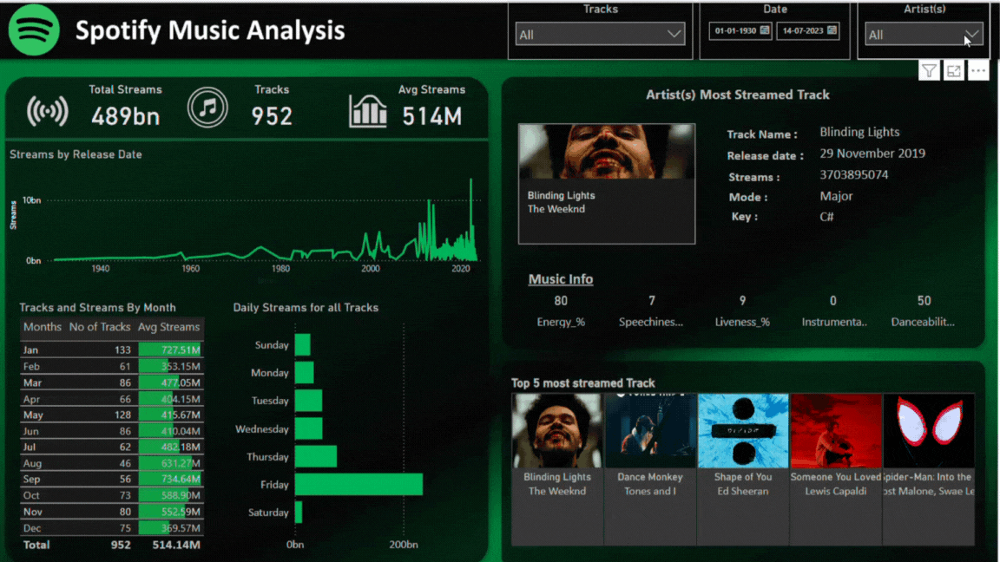

# 🎧 Spotify Music Analysis Dashboard

  

This project is a Spotify Music Analysis Dashboard built using **Power BI**, inspired and guided by a YouTube tutorial. It highlights key insights from streaming data with a clear and interactive layout.

---

## 📌 What I Did

### 🔧 Data Cleaning & Transformation
- Removed duplicate and erroneous entries
- Handled missing values appropriately
- Created new calculated columns from existing ones

### 🎨 Dashboard Design
- Planned layout and structure using **PowerPoint**
- Emphasized readability and visual impact

### 📊 Power BI Visuals & Interactivity
- Used Power BI’s new visuals to build a fully interactive dashboard
- Configured **interactions between visuals** for dynamic exploration
- Visualized key metrics: Total Streams, Top Tracks, Release Timeline, and more

---

## 📅 Project Summary

- **Tools Used:** Power BI, PowerPoint, YouTube tutorial guidance
- **Skills Practiced:** Data wrangling, visual storytelling, dashboard UX/UI design
- **Dataset:** Spotify streaming data (self-prepped or from the tutorial source)

---

## 📷 Dashboard Features

- ✅ Most Streamed Track & Artist Info  
- ✅ Streams Over Time Graph  
- ✅ Tracks by Month with Avg Streams  
- ✅ Day-wise Stream Distribution  
- ✅ Top 5 Most Streamed Tracks  

---

## 📂 Files Included
- `Spotify_Screenshot.png` – Dashboard preview
- `Spotify Most Streamed Songs 2023 Dataset` - Dataset
- `spotify_background` - Background
  
---

## 🙌 Credits
Thanks to the YouTube tutorial creator for guidance throughout the project.
RUTH KINGSLEY ( https://youtu.be/pC1gQL-b6b8?si=NSvT6uTIvEJc8M4H)

